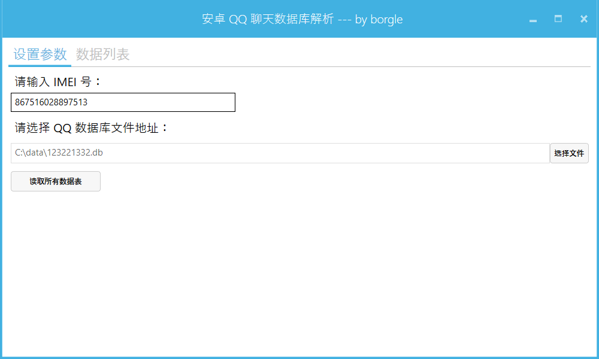
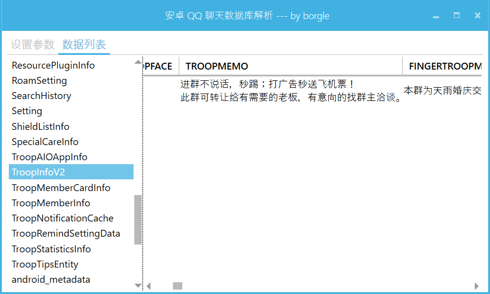

# 安卓 QQ 消息数据库阅读工具
QQ 在 Android 平台上的消息保存方式，其实几年前就有分析文章流露出来过，这个小工具也本着复习 Wpf 开发知识的目的而进行的，无任何商业目的，请勿用于非法用途。

### Dependencies
* [SQLite][1]
* [MvvmLight][2]
* [MahApps.Metro][3]

### Screenshot

### Todo
- [ ] 导出数据
- [ ] 分页浏览数据
- [ ] 解密消息体 msgData
- [x] 读取所有数据表
- [x] 解密群资料
- [x] 解密群名片
- [x] 解密好友资料

### Other
msgData 是个非常重的对象，在反编译的 apk 里面看到，消息类型达到数百种，目前只完成 msgType=-1000 的解析。

[1]: https://system.data.sqlite.org
[2]: http://www.mvvmlight.net/
[3]: https://mahapps.com/